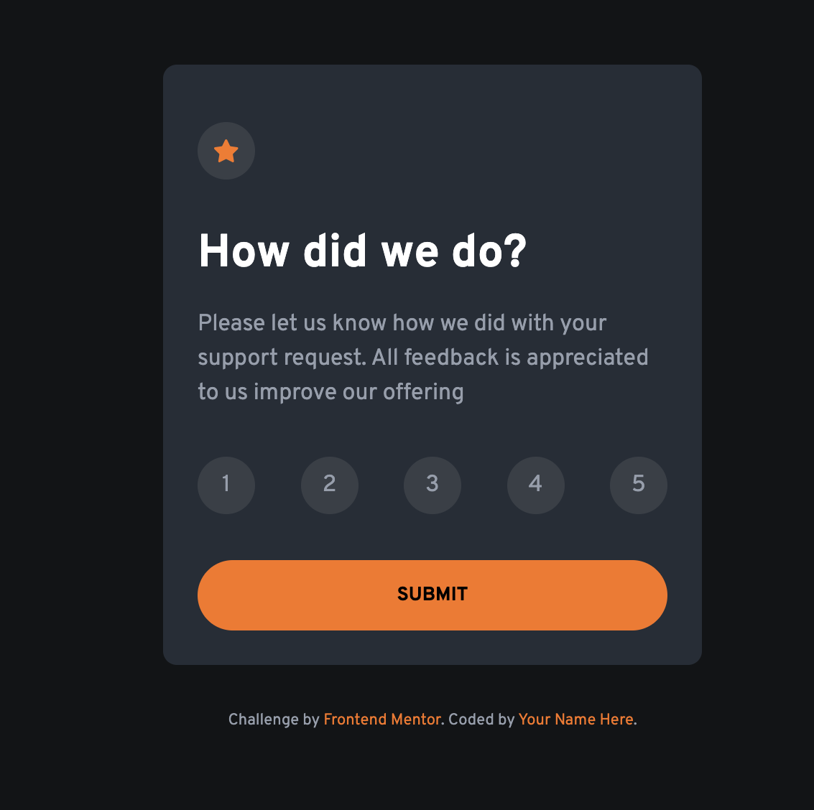

# Frontend Mentor - Interactive rating component solution

This is a solution to the [Interactive rating component challenge on Frontend Mentor](https://www.frontendmentor.io/challenges/interactive-rating-component-koxpeBUmI). Frontend Mentor challenges help you improve your coding skills by building realistic projects.

## Table of contents

- [Overview](#overview)
  - [The challenge](#the-challenge)
  - [Screenshot](#screenshot)
  - [Links](#links)
- [My process](#my-process)
  - [Built with](#built-with)
  - [What I learned](#what-i-learned)
  - [Continued development](#continued-development)
  - [Useful resources](#useful-resources)
- [Author](#author)
- [Acknowledgments](#acknowledgments)

## Overview

### The challenge

Users should be able to:

- Hide/Show the answer to a question when the question is clicked
- Navigate the questions and hide/show answers using keyboard navigation alone
- View the optimal layout for the interface depending on their device's screen size
- See hover and focus states for all interactive elements on the page

### Screenshot



### Links

- Solution URL: [Add solution URL here](https://github.com/lawal-sherif-itunu/interactive-rating-component)
- Live Site URL: [Add live site URL here](https://lawal-sherif-itunu.github.io/interactive-rating-component/)

## My process

### Built with

- Semantic HTML5 markup
- CSS custom properties
- Flexbox
- Mobile-first workflow
- JavaScript

### What I learned

refreshing of HTML/ CSS knowledge as well as practicing JavaScript

To see how you can add code snippets, see below:

```css
main {
  display: flex;
  flex-wrap: wrap;
  justify-content: center;
  align-content: center;
  height: 100vh;
}
```

```js
ones.forEach(function (one) {
  one.addEventListener("click", function () {
    if (answer1.style.display === "none") {
      answer1.style.display = "block";
      plus.src = "images/icon-minus.svg";
    } else {
      answer1.style.display = "none";
      plus.src = "images/icon-plus.svg";
    }
  });
});
```

### Continued development

JavaScript

## Author

- Website - [lawal-sherif-itunu](https://github.com/lawal-sherif-itunu)
- Frontend Mentor - [@lawal-sherif-itunu](https://www.frontendmentor.io/profile/lawal-sherif-itunu)
- Twitter - [@sheriflawal12](https://x.com/SherifLawal12)

## Acknowledgments

Sharon Olaitan
